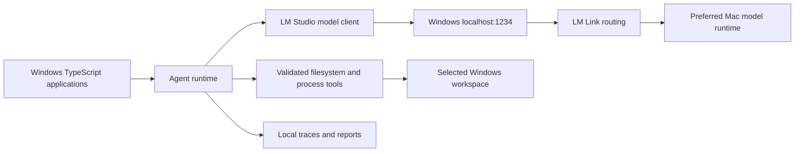

# Nolan Young Local Agent Laboratory — LM Studio Edition

A security-first TypeScript monorepo for running three local AI agent workflows on Windows while LM Studio and LM Link provide model inference. See [Getting Started](docs/getting-started.md) for setup and commands.

The runtime uses no OpenAI API key, no hosted model provider, and no Ollama. Applications connect to LM Studio on `http://127.0.0.1:1234`; LM Studio decides whether inference runs on Windows or a preferred linked Mac.

## Applications

- `code-editor` — plan, dry-run, and apply scoped source changes.
- `build-assistant` — diagnose and repair approved one-shot or watcher builds.
- `release-engineer` — validate, prepare, package, and checksum releases without publishing.

## Requirements

- Node.js 24 LTS
- npm 11 or newer
- LM Studio 0.4.0 or newer for live inference and token authentication
- Optional linked Mac configured manually through LM Link

## Quick start

```bash
npm ci
npm run validate
npm run models:lmstudio
npm run check:lmstudio
npm run check:lmlink
```

Copy `.env.example` to `.env` only when overriding defaults. The exact model key must match LM Studio:

```dotenv
LM_STUDIO_MODEL=openai/gpt-oss-20b
```

Run application help:

```bash
npm run code-editor -- --help
npm run build-assistant -- --help
npm run release-engineer -- --help
```

## Architecture



The Mac receives only bounded prompt context. It never receives direct filesystem, process, or network capabilities from this repository.

## Validation

`npm run validate` runs formatting checks, linting, strict type checking, offline tests, and builds. Tests and CI use the explicit mock model provider and do not require LM Studio, LM Link, a Mac, or network access.

## Documentation

- [Architecture](docs/architecture.md)
- [Security model](docs/security-model.md)
- [LM Studio setup](docs/lm-studio-setup.md)
- [LM Link setup](docs/lm-link-setup.md)
- [Windows-to-Mac topology](docs/windows-mac-topology.md)
- [LM Link troubleshooting](docs/troubleshooting-lm-link.md)
- [Configuration](docs/configuration.md)

Licensed under the MIT License.
