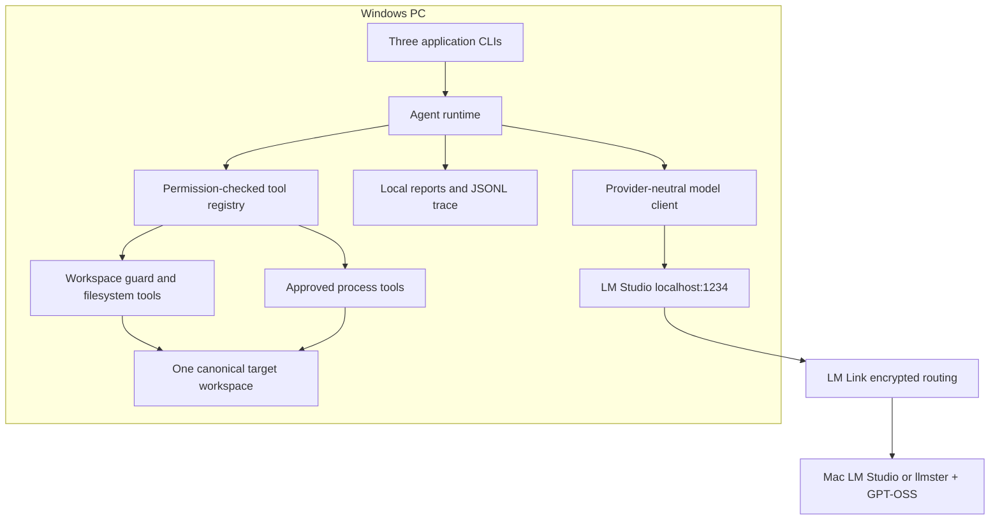

# Architecture

The laboratory separates four authorities:

1. Applications own workflow state, deterministic pass/fail decisions, and reports.
2. The agent runtime owns structured conversation turns, permission checks, limits, and retries.
3. TypeScript tools own every filesystem and process operation on Windows.
4. LM Studio owns model access; LM Link may route inference to the preferred Mac.

The public application configuration remains `http://127.0.0.1:1234`. The SDK adapter derives the WebSocket form needed by `@lmstudio/sdk`. No application knows a Mac IP or receives a Mac filesystem handle.

## Package boundaries

- `shared-types` owns Zod wire contracts.
- `local-model-client` owns SDK/REST details and the explicit mock.
- `workspace-security` owns root/path/policy/lock decisions.
- `filesystem-tools` owns bounded text operations and atomic mutations.
- `process-tools` owns approved processes and lifecycle cleanup.
- `tracing` owns local audit metadata and reports.
- `agent-runtime` owns structured turns, permissions, context, retries, and deduplication.

Each application composes these packages but does not bypass them.
